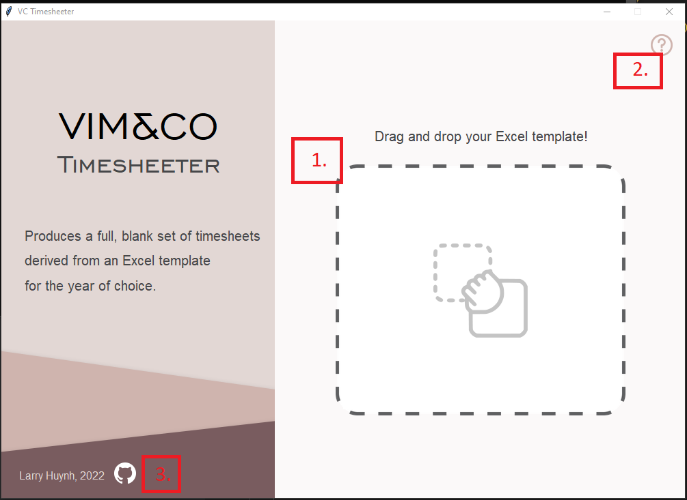
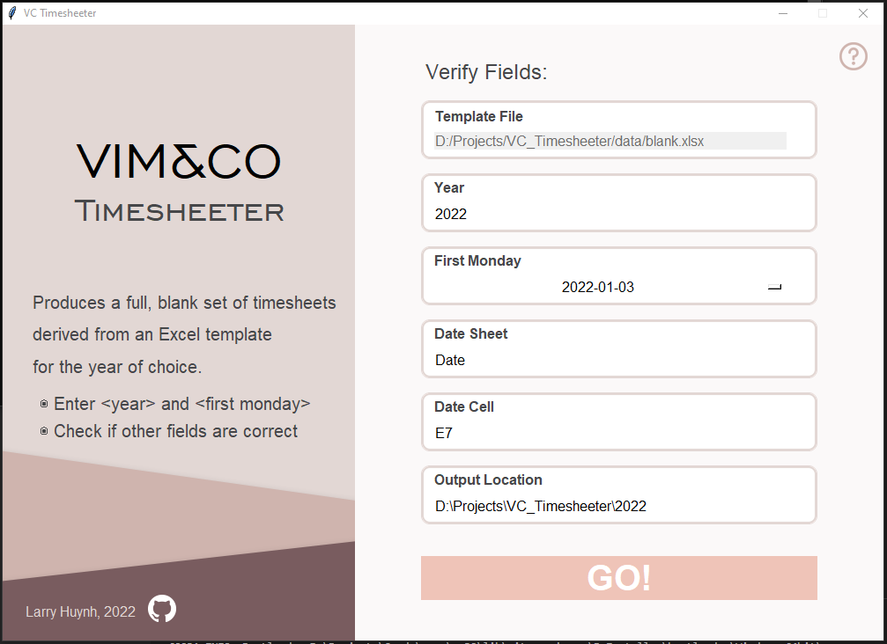

# How to use V&C Timesheeter

### [>> Homepage](https://github.com/LarryHH/VC_Timesheeter/blob/master/README.md)

## Table of Contents

1. [**Prerequisites**](prereqs)

2. [**Template Excel File**](excel)
   1. [Accepted File Types](#excel-1)
   2. [Template File Contents](#excel-2)
   3. [Updating the Template File](#excel-3)

3. [**UI - Drag and Drop Window**](#dnd)

4. [**UI - Form Window**](#form)

5. [**Expected Outputs**](#outputs)


<a id="prereqs"></a>
# 1. Prerequisites <small>[[↑](#table-of-contents)]</small>

- Windows 10 or later
- Installed Custom Font: [Engravers Gothic BT Regular](https://www.dafontfree.net/engraversgothic-bt-regular/f123235.htm)

<a id="excel"></a>
# 2. Template Excel File <small>[[↑](#table-of-contents)]</small>

<a id="excel-1"></a>
## 2.1. Accepted File Types

V&C Timesheeter will only accept MS Excel files and associated file types: `xls` and `xlsx`. Other commonly used Excel file types, such as `csv` and `tsv` are not supported.

<a id="excel-2"></a>
## 2.2. Template File Contents

The provided `template.xlsx` file must adhere to the following:
- There should exist a sheet named _Date_ (or _date_): the `Date Sheet`.
- The `Date Sheet` sheet should contain only 1 date-typed cell: the `Date Cell`.

The V&C Timesheeter will read the given template file and locate the `Date Cell` within `Date Sheet`. It will then propagate timesheets for every payroll period in the specified year using the template file as a basis. That is, each new timesheet Excel file will have __all its contents duplicated, with only its `Date Cell` updated for the relevant period__.

In addition to not accepting file formats other than `xls` and `xlsx`, V&C Timesheeter will also not accept the following:
- Excel files with no `Date Sheet`.
- Excel files with no `Date Cell`. There must be a date-type cell within `Date Sheet` with an existing value.
- Excel files with multiple `Date Cells` within the `Date Sheet`. Ensure that there is only 1 cell within `Date Sheet` that could be considered the `Date Cell`.

Relevant messages will be displayed to the user if a file matching any of the above descriptions is provided (see [Troubleshooting](#Troubleshooting) for more info).

<a id="excel-3"></a>
## 2.3. Updating the Template File

New timesheets must be updated for various business reasons, such as updating for incoming/outgoing staff. V&C Timesheeter allows the user to submit these changes in one location (the `template.xlsx` file) and propagate these changes to every subsequent timesheet. Simply edit `template.xlsx` for the required changes and run V&C Timesheeter using this file. All changes, including sheet renaming, cell formatting and colouring, and submitted hours will be propagated. 

**NOTE:** This means that if a staff member has recorded worked hours in `template.xlsx`, those hours will be propagated to every subsequent timesheet. Make sure that each staff member's recorded hours are blank, and all changes are correct before running `template.xlsx` through the program.

DO NOT edit the following:
- The `Date Sheet`
- The `Date Cell`

<a id="dnd"></a>
# 3. UI - Drag and Drop Window <small>[[↑](#table-of-contents)]</small>
<p align="center">
  
</p>

The Drag and Drop Window serves as the entry point for supplying the `template.xlsx` file into the program. The window consists of the following elements:
1. The drag and drop space. Drag `template.xlsx` from your file explorer into the this space. You will then be presented with the Form Window.
2. The Help Icon brings the user to this instructions site.
3. The GitHub Icon brings the user to the repository mainpage.

<a id="form"></a>
# 4. UI - Form Window <small>[[↑](#table-of-contents)]</small>
<p align="center">
  
</p>

The Form Window allows the user to specify customisations for the outputted timesheets. 
<br>
**NOTE:** For basic usage, only the `Year` and `First Monday` fields need to be edited.

**Template File**
- The `template.xlsx` file supplied to the Drag and Drop Window. 
- This field is non-editable. 
- If the supplied `template.xlsx` file is incorrect for whatever reason, the user will need to restart the program and begin the process from the beginning.  

**Year (Required)**
- The year for which timesheets will be created. 
- This value is auto-populated with the current year, but the user should double-check and enter the relevant year for their needs. 
- `Year` will only accept integer values that do not exceed 9999. The program will not execute for values outside this specification.
- Both the `First Monday` and `Output Location` fields will have their values adjusted based on the `Year` value.
   - The `First Monday` drop-down menu will adjust its values for the given `Year`.
   - `Output Location` will update its ending folder based on the given `Year`.

**First Monday (Required)**
- The date of the __first payroll Monday__ for the `Year`.
- As timesheets are alloted on a fortnightly basis, it is possible for the first payroll period to not coincide with the first week of the year. This offset will be by at most 1 week.
- Values for `First Monday` are presented in a drop-down menu; click in the text area and select the first payroll Monday from the menu.

**Date Sheet**
- The `Date Sheet` containing the `Date Cell`.
- This value is automatically detected by the program, but the user should confirm that this value is correct, otherwise the user can edit this value as needed.

**Date Cell**
- The `Date Cell` containing the date that the timesheet relies on for cataloging days in the payroll period.
- This value is automatically detected by the program, but the user should confirm that this value is correct, otherwise the user can edit this value as needed.

**Output Location**
- The folder that the generated timesheets will be located in.
- This value represents the file path of the outputted folder. The program will automatically specify `Output Location` as a folder in the current directory of the `VC_Timesheeter.exe` executable as `..\exe_directory\{year}`, where `{year}` is the value inputted into `Year`. This folder will be automatically created by the program once the user presses the `GO!` button.
- The user can specify an output location of their choosing and all timesheets will be generated in this location instead. 
- **NOTE:** If the user inputs a folder path that already exists within the file system, then the program fail.

Once all fields have been entered and checked for correctness, press the `GO!` button to begin generating the timesheets. The process will be complete when the `GO!` button text changes from `Processing...` to `Done! Exit now`. At this point, the timesheets should be created and the user can exit the program.

<a id="outputs"></a>
# 5. Expected Outputs <small>[[↑](#table-of-contents)]</small>

The user should see contained in the folder designated by `Output Location`:
- 12 contained folders, one for each month of the year,
- Within each folder should be a number of timesheets depending on how many payroll periods there are for that month in that year.

Below is an example directory tree structure for the inputs of:
- `Year`: 2022
- `First Monday`: 2022-01-03

```
├───01 JAN
│       01 3 JAN - 16 JAN.xlsx
│       02 17 JAN - 30 JAN.xlsx
│       03 31 JAN - 13 FEB.xlsx
│
├───02 FEB
│       01 14 FEB - 27 FEB.xlsx
│       02 28 FEB - 13 MAR.xlsx
│
├───03 MAR
│       01 14 MAR - 27 MAR.xlsx
│       02 28 MAR - 10 APR.xlsx
│
├───04 APR
│       01 11 APR - 24 APR.xlsx
│       02 25 APR - 8 MAY.xlsx
│
├───05 MAY
│       01 9 MAY - 22 MAY.xlsx
│       02 23 MAY - 5 JUN.xlsx
│
├───06 JUN
│       01 6 JUN - 19 JUN.xlsx
│       02 20 JUN - 3 JUL.xlsx
│
├───07 JUL
│       01 4 JUL - 17 JUL.xlsx
│       02 18 JUL - 31 JUL.xlsx
│
├───08 AUG
│       01 1 AUG - 14 AUG.xlsx
│       02 15 AUG - 28 AUG.xlsx
│       03 29 AUG - 11 SEP.xlsx
│
├───09 SEP
│       01 12 SEP - 25 SEP.xlsx
│       02 26 SEP - 9 OCT.xlsx
│
├───10 OCT
│       01 10 OCT - 23 OCT.xlsx
│       02 24 OCT - 6 NOV.xlsx
│
├───11 NOV
│       01 7 NOV - 20 NOV.xlsx
│       02 21 NOV - 4 DEC.xlsx
│
└───12 DEC
        01 5 DEC - 18 DEC.xlsx
        02 19 DEC - 1 JAN.xlsx
```
